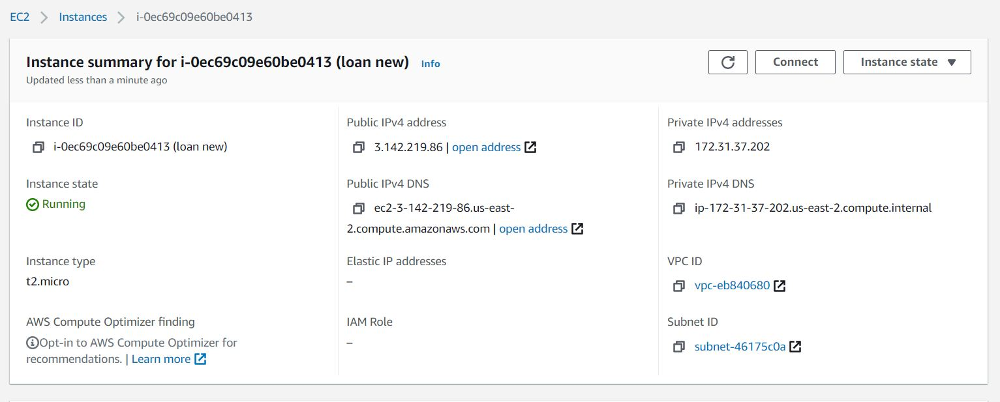
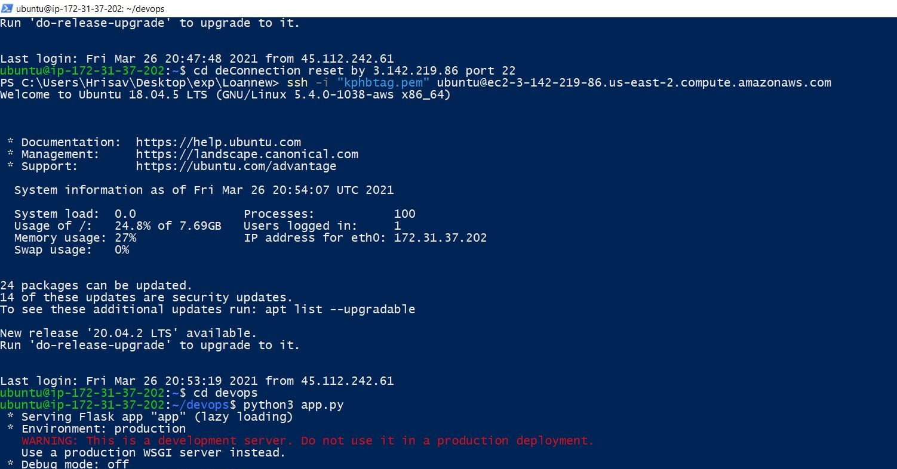
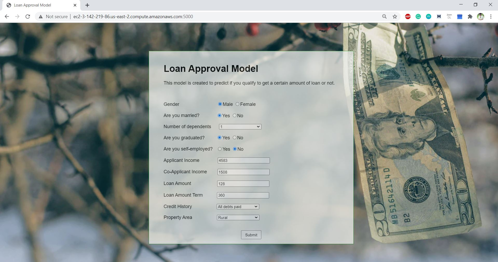
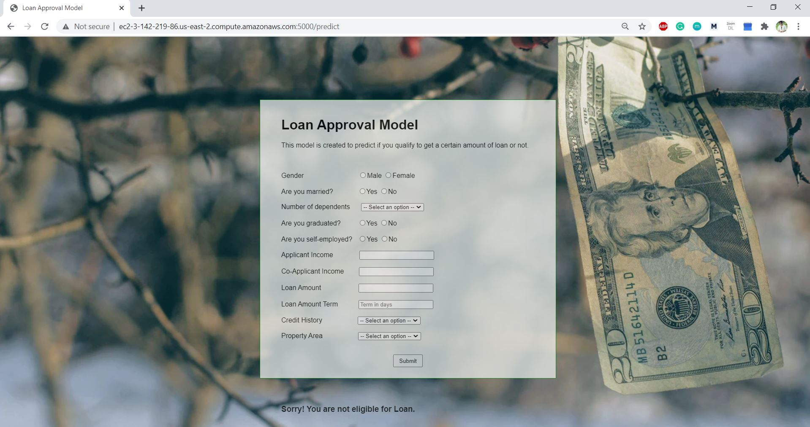

# Loan Acceptance Prediction

Data set taken from : https://datahack.analyticsvidhya.com/contest/practice-problem-loan-prediction-iii/

Problem Statement
-

Dream Housing Finance company deals in all home loans. They have presence across all urban, semi urban and rural areas. Customer first apply for home loan after that company validates the customer eligibility for loan.

Company wants to automate the loan eligibility process (real time) based on customer detail provided while filling online application form. These details are Gender, Marital Status, Education, Number of Dependents, Income, Loan Amount, Credit History and others. To automate this process, they have given a problem to identify the customers, those are eligible for loan amount so that they can specifically target these customers. Here they have provided a partial data set.

Files
-

- loan_acceptance_data.csv (dataset)
- Loan_Acceptance.ipynb (notebook file with EDA, model building)
- loan.py (python file for model building)
- loan_approval.pkl (pickle file consisting the model)
- app.py (python file for model deployment)
- requirements.txt (necessary libraries)
- templates/index.html (html file for frontend)

How to run
-

- Open the project in an editor
- Using the command install all libraries -> "pip install -r requirements.txt"
- Uncomment the code in app.py -> app.run(debug=True)
- Comment the code in app.py -> app.run(host="0.0.0.0")
- Run the app.py file

Algorithms
-

We tried to perform model building using K Nearest Neighbors, Decision Tree, Logistic Regression, Gradient Boosting. Also we tried to find out the best result by hyper parameter tuning. We got the best Recall and F1 score when we applied **Gradient Boosting** with GridSearchCV (recall = 0.53, f1-score = 0.60). So we went ahead with this algorithm for model building.

Deployment on AWS EC2
-

- Create an instance, generate PEM file.
- Push code to AWS server using FileZilla.
- Add source 0.0.0.0/0 with port 5000 in EC2.
- Connect to server using Powershell and run app.py file.
- Run the link on browser (http://ec2-3-142-219-86.us-east-2.compute.amazonaws.com:5000/) to work on the model.

Steps Involved
-

- Understanding Data
- Data Cleaning
- Exploratory Analysis
- Feature Engineering
- Encoding
- Feature Selection & Scaling
- Model Building
- Use of PyCaret
- UI Building
- Deployment

Output
-

UI was built and we will have to put in details of the customer whose loan eligibility we would like to predict.

